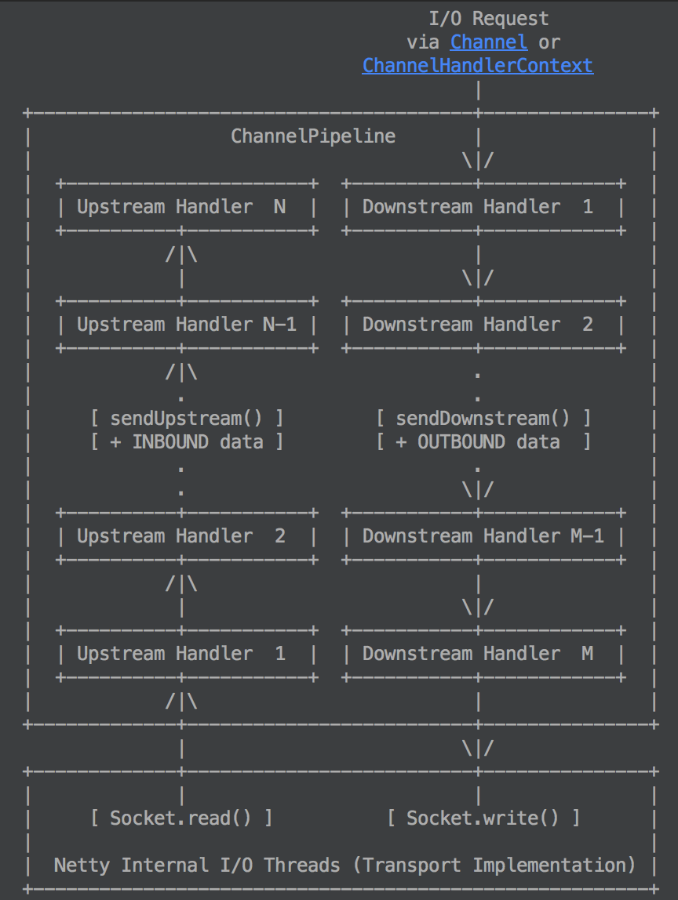

## 重要的组件

### ChannelFactory

ChannelFactory is a factory which creates and manages Channels and its related resources. It processes all I/O requests 
and performs I/O to generate ChannelEvents. Netty provides various ChannelFactory implementations. We are implementing 
a server-side application in this example, and therefore NioServerSocketChannelFactory was used. Another thing to note 
is that it does not create I/O threads by itself. It is supposed to acquire threads from the thread pool you specified 
in the constructor, and it gives you more control over how threads should be managed in the environment where your 
application runs, such as an application server with a security manager.

NioClientSocketChannelFactory

NioServerSocketChannelFactory

### ServerBootstrap

 a helper class that sets up a server. You can set up the server using a Channel directly. However, please note that 
 this is a tedious process and you do not need to do that in most cases.
 
ClientBootStrap
 
### ChannelPipelineFactory

Whenever a new connection is accepted by the server, a new ChannelPipeline will be created by the specified 
ChannelPipelineFactory. The new pipeline contains the DiscardServerHandler. As the application gets complicated, 
it is likely that you will add more handlers to the pipeline and extract this anonymous class into a top level class 
eventually.
 
 ### ChannelBuffer
 
 It's similar to NIO ByteBuffer, but it is easier to use and more flexible. For example, Netty allows you to create 
 a composite ChannelBuffer which combines multiple ChannelBuffers reducing the number of unnecessary memory copy.
 
 Although it resembles to NIO ByteBuffer a lot, it is highly recommended to refer to the API reference. Learning how to 
 use ChannelBuffer correctly is a critical step in using Netty without difficulty.
 
 ### ChannelEvent
 
 A ChannelEvent object has a reference to its associated Channel. Here, the returned Channel represents the connection 
 which received the MessageEvent. We can get the Channel and call the write method to write something back to the 
 remote peer.
 
 
### ChannelFuture
 
 A ChannelFuture represents an I/O operation which has not yet occurred. It means, any requested operation might not 
 have been performed yet because all operations are asynchronous in Netty
  
### ChannelFutureListener

 监听ChannelFuture情况
 
### FrameDecoder

解决黏连包的拆包问题

calls decode method with an internally maintained cumulative buffer whenever new data is received.

### ChannelEvet

Upstream events and downstream events, and their interpretation
Every event is either an upstream event or a downstream event. If an event flows forward from the first handler to the 
last handler in a ChannelPipeline, we call it an upstream event and say "an event goes upstream." If an event flows 
backward from the last handler to the first handler in a ChannelPipeline, we call it a downstream event and say "an 
event goes downstream." (Please refer to the diagram in ChannelPipeline for more explanation.)
When your server receives a message from a client, the event associated with the received message is an upstream event. 
When your server sends a message or reply to the client, the event associated with the write request is a downstream 
event. The same rule applies for the client side. If your client sent a request to the server, it means your client 
triggered a downstream event. If your client received a response from the server, it means your client will be notified 
with an upstream event. Upstream events are often the result of inbound operations such as InputStream.read(byte[]), and 
downstream events are the request for outbound operations such as OutputStream.write(byte[]), 
Socket.connect(SocketAddress), and Socket.close().

